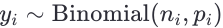
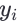
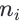
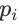
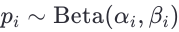
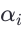
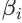
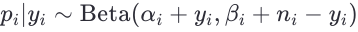
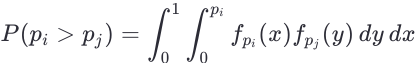

# Bayesian-candidates

# Bayesian Approach to Calculate Confidence Intervals for Election Results

When dealing with small sample sizes or incomplete data, a **Bayesian approach** can be particularly useful because it allows us to incorporate prior knowledge (or assumptions) about the election results into the analysis. This is especially relevant when classical frequentist methods fail due to insufficient data.

## Problem Setup:

- **Objective**: Estimate the probability of each of 2 candidate winning an election.
- **Data Availability**: Limited data (e.g., partial vote counts or small sample sizes).
- **Goal**: Calculate credible intervals (Bayesian analog of confidence intervals) for the proportion of votes each candidate receives.

## Bayesian Model:

1. **Likelihood**: Assume the observed vote counts follow a **binomial distribution**:

   

where:
-  is the number of votes observed for candidate `i`,
-  is the total number of votes sampled for candidate `i`,
-  is the unknown proportion of votes for candidate `i`.

2. **Prior**: Use a **Beta distribution** as the prior for , which is conjugate to the binomial likelihood:
   
   

Here,  and  represent prior beliefs about the proportion of votes for candidate `i`. For example:
- If no prior information is available, use a non-informative prior like `Beta(1, 1)` (uniform distribution).
- If you have prior knowledge (e.g., historical data), set  and  accordingly.

3. **Posterior**: The posterior distribution for  is also a Beta distribution:

   

4. **Credible Interval**: Compute the credible interval (e.g., 95%) from the posterior distribution of `p_i`. This interval reflects the range of plausible values for   given the observed data and prior beliefs.

5. **Reversal of Winner**: To determine the probability that one candidate overtakes another, compute:
   
   

In practice, this can be approximated using Monte Carlo sampling from the posterior distributions.

## Explanation of the Code:
1. **Data Input** : The observed vote counts (votes) and total sample sizes (sample_size) are provided for each candidate.
2. **Posterior Parameters**: The posterior parameters for each candidate are calculated based on the observed data and the prior.
3. **Credible Intervals**: The ```credible_interval``` function computes the credible interval for each candidate's vote proportion using the posterior Beta distribution.
4. **Overtaking Probability**: The The ```prob_overtake``` function uses Monte Carlo sampling to estimate the probability that one candidate's vote proportion exceeds another's.
## Example Output:
For the given input data:

- Candidate A: 45 votes out of 100
- Candidate B: 55 votes out of 100

The output might look like:

```{text}
Credible Intervals:
Candidate_A: (0.357, 0.548)
Candidate_B: (0.452, 0.643)
Probability that Candidate A beats Candidate B: 0.1789
```

This indicates that while Candidate B currently leads, there is still a ~17.9% chance that Candidate A could overtake Candidate B given the uncertainty in the data.

## Multiple candidates. Two rounds
Exit pull results:
- **Candidate A**: 25 votes
- **Candidate B**: 30 votes
- **Candidate C**: 20 votes
- **Candidate D**: 15 votes
- **Candidate E**: 10 votes

### Problem Setup:
**Objective** : Estimate the probability of each candidate winning an election or passing to the second round if no candidate gets more than 50% of the votes.<br>
**Data Availability** : Limited data (e.g., partial vote counts or small sample sizes).<br>
**Goal** : Calculate credible intervals for the proportion of votes each candidate receives and determine the probabilities of winning or passing to the second round.
